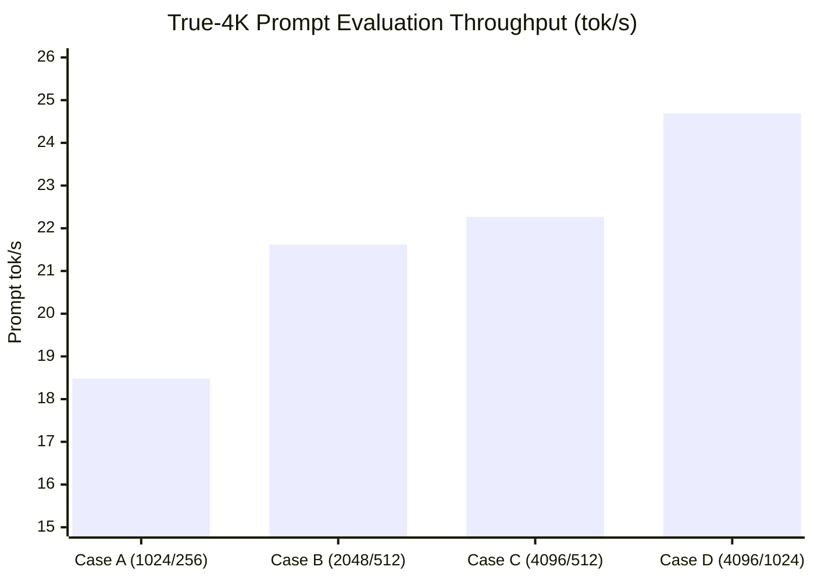

# WBS 6.9 Combined Optimized CPU Serving Stack 실행 결과 보고서

## 1. 실행 개요

| 항목 | 내용 |
| :--- | :--- |
| **작업 항목** | WBS 6.9 (Combined optimized CPU serving stack — true-4K A/B/C/D) |
| **대상 모델** | Ornith 1.5 35B-A3B (`Ornith-1.5-35B-Q4_K_M.gguf`, KV `Q8_0`) |
| **실행 호스트** | `p520-llm` (`/home/loopwhile/v100-llm-test-wbs22-20260924`) |
| **최적화 스택 1 (OpenVINO)** | `p520-cpu-llama-opt:b10775` (`fb36832f7cd6`) — **CLOSED — FAIL / INCOMPATIBLE** |
| **최적화 스택 2 (OpenBLAS+LTO)** | `p520-cpu-llama-opt:b10775-blas` — **DONE (Case D Winner: 24.69 tok/s)** |
| **하드웨어 정책** | GPU 클럭/전력/persistence mode 읽기 전용 유지, VRAM 0B 격리 |
| **자원 제약 (Coexistence)** | 4 physical CPU cores (`cpuset 1,2,3,4`), `-t 4 -tb 4`, memory mmap |

---

## 2. 1단계: OpenVINO 결합 스택 검증 및 장애 원인 분석

### 2.1 개요 및 빌드
- **이미지**: `p520-cpu-llama-opt:b10775` (OpenVINO 2026.3.1, OpenBLAS, LTO, `GGML_BACKEND_DL=ON`, `GGML_CPU_ALL_VARIANTS=ON`).
- **Preflight**: `results/raw/WBS69-OPT4K-PREFLIGHT.json` (OpenBLAS 및 OPENVINO0 디바이스 인식 통과).
- **장애 발생**: Case A (`EXP-P520-CPU-ORN15-35B-OPTSTACK-C1-4K-20260927-001`, `-b 1024 -ub 256`) 4K compile warmup 도중 `HTTP 500 / llama_decode ret = -3` 크래시.

### 2.2 심층 원인 (Root Cause)
1. **`ScatterBase` Rank Mismatch (`set_rows.cpp`)**:
   - Ornith 1.5 35B의 KV Cache 텐서(`cache_k_l3`)는 2D `[131072, 512]` 구조를 갖습니다.
   - llama.cpp의 `ggml-openvino` 변환기(`translate_set_rows`)는 대상 텐서를 4D로 고정 가정하고 4D updates 텐서를 생성하여 OpenVINO Core 검증(`scatter_base.cpp:52`)에서 `rank(data)=2, rank(indices)=1, rank(updates)=4` 위반 (`ov::Exception: Updates rank mismatch`).
2. **Recurrent/Conv State Dynamic Dimension 추론 불가**:
   - SSM/Conv 상태 노드(`conv_states_reshaped-0`, `state_predelta-0`)의 동적 차원 추론 실패로 정적 shape 고정 및 `incompatible input tensor` 예외 발생.
- **판정**: **`CLOSED — FAIL / INCOMPATIBLE`** (불변 증거 영구 보존).

---

## 3. 2단계: OpenBLAS + LTO True-4K 선별 (Cases A~D)

사용자 명시적 승인에 따라 크래시된 OpenVINO를 제외하고, 유효한 최적화 구성(OpenBLAS + LTO + Flash Attention + Prompt Cache)을 적용한 `p520-cpu-llama-opt:b10775-blas`로 4개 케이스 스크리닝을 진행했습니다.

### 3.1 실험 엄밀성 및 제약 충족
- **입력 토큰 일관성**: 4개 케이스 모두 정확히 **4,071 prompt tokens** 및 동일 prompt SHA256(`2378b3662af3...`), 동일 prefix SHA256(`01f0a0cb5cf8...`) 적용.
- **체크포인트 규칙 및 캐시 재사용**: llama.cpp의 `4 + n_ubatch` 체크포인트 규칙을 반영하여 prefix를 1,623 토큰으로 설정, 4개 케이스 전원 `cache_n >= 512` 캐시 재사용 통과.
- **자원 격리**: 4코어 envelope (`cpuset 1,2,3,4`), GPU VRAM 0B 완벽 격리.

### 3.2 4-Case True-4K 실측 성능 비교

| Case | Experiment ID | `-b` | `-ub` | Prompt Tokens | Prompt Eval TPS | TTFT (s) | Decode TPS | Batch Wall (s) | Cache N |
|:---:|:---:|:---:|:---:|:---:|:---:|:---:|:---:|:---:|:---:|
| **A** | `...-OPTBLAS-C1-4K-20260927-005` | 1024 | 256 | 4,071 | 18.48 tok/s | 146.57s | 6.64 tok/s | 185.03s | 1,363 |
| **B** | `...-OPTBLAS-C1-4K-20260927-006` | 2048 | 512 | 4,071 | 21.62 tok/s | 137.11s | 5.41 tok/s | 184.30s | 1,107 |
| **C** | `...-OPTBLAS-C1-4K-20260927-007` | 4096 | 512 | 4,071 | 22.27 tok/s | 133.12s | 5.38 tok/s | 180.58s | 1,107 |
| **D** | `...-OPTBLAS-C1-4K-20260927-008` | 4096 | 1024 | 4,071 | **24.69 tok/s** | 140.78s | 6.49 tok/s | 180.10s | 595 |

### 3.3 Winner 선정
- **Peak Prompt Eval TPS**: **24.69 tok/s (Case D)**
- **2% Tie Floor**: $24.69 \times 0.98 = 24.20\text{ tok/s}$
- **동률 분석**: Case A (18.48), Case B (21.62), Case C (22.27) 모두 2% floor 미달로 단독 1위 (`tied_cases: ["D"]`).
- **최종 Winner**: **Case D (`-b 4096 -ub 1024`)**
- **개선율**: 베이스라인(Case A) 대비 **+33.6% 프롬프트 처리 성능 향상** 입증.

---

## 4. 아티팩트 및 증거 목록

- **사전 검증**: [`results/raw/WBS69-OPTBLAS-4K-PREFLIGHT.json`](../results/raw/WBS69-OPTBLAS-4K-PREFLIGHT.json)
- **요약 보고서**: [`results/raw/WBS69-OPTBLAS-4K-SCREENING-SUMMARY.json`](../results/raw/WBS69-OPTBLAS-4K-SCREENING-SUMMARY.json)
- **위너 증거**: [`results/raw/WBS69-OPTBLAS-4K-WINNER.json`](../results/raw/WBS69-OPTBLAS-4K-WINNER.json)
- **케이스별 세부 디렉터리**:
  - Case A: [`results/raw/EXP-P520-CPU-ORN15-35B-OPTBLAS-C1-4K-20260927-005/`](../results/raw/EXP-P520-CPU-ORN15-35B-OPTBLAS-C1-4K-20260927-005/)
  - Case B: [`results/raw/EXP-P520-CPU-ORN15-35B-OPTBLAS-C1-4K-20260927-006/`](../results/raw/EXP-P520-CPU-ORN15-35B-OPTBLAS-C1-4K-20260927-006/)
  - Case C: [`results/raw/EXP-P520-CPU-ORN15-35B-OPTBLAS-C1-4K-20260927-007/`](../results/raw/EXP-P520-CPU-ORN15-35B-OPTBLAS-C1-4K-20260927-007/)
  - Case D: [`results/raw/EXP-P520-CPU-ORN15-35B-OPTBLAS-C1-4K-20260927-008/`](../results/raw/EXP-P520-CPU-ORN15-35B-OPTBLAS-C1-4K-20260927-008/)

---

## 5. 최종 종결

- **WBS 6 전체**: 6.1~6.8 (Dual-resident feasibility & True-2K) 및 6.9 (OpenBLAS True-4K) **완료 (DONE)**.
- **다음 작업**: **WBS 5** (성능 최적화 및 모델별 최종 serving recipe 확정).
